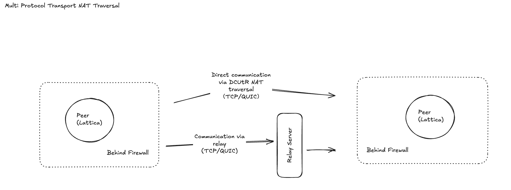

# p2p-lattica
Make peer-2-peer global works

## Bindings

We provide bindings to the following languages:
- [Rust](https://github.com/GradientHQ/lattica/tree/main/lattica) (Original implementation)
- [Python](https://github.com/GradientHQ/lattica/tree/main/bindings/python)

## Examples
We provide many examples, which you can find at [Example](https://github.com/GradientHQ/lattica/tree/main/lattica/examples)

## Getting Started
### Rust Library

- DHT simple store
```rust
// create lattica instance
let mut lattica = network::Lattica::builder()
  .with_bootstrap_nodes(bootstrap_nodes.clone())
  .build().await?;

// put record
let current_time = common::time::get_current_timestamp();
let expiration_time = current_time + 600.0;
lattica.store_simple("greeting", "Hello, World!".as_bytes().to_vec(), expiration_time).await?;

// get record
let result = lattica.get_with_subkey("greeting").await?;
```

- DHT subkey store
```rust
// create lattica instance
let mut lattica = network::Lattica::builder()
  .with_bootstrap_nodes(bootstrap_nodes.clone())
  .build().await?;

// put subkey record
lattica.store_subkey("party_vote", "alice", "yes".as_bytes().to_vec(), expiration_time).await?;
lattica.store_subkey("party_vote", "bob", "yes".as_bytes().to_vec(), expiration_time).await?;
lattica.store_subkey("party_vote", "carol", "no".as_bytes().to_vec(), expiration_time).await?;
lattica.store_subkey("party_vote", "david", "maybe".as_bytes().to_vec(), expiration_time).await?;

// get subkey record
lattica.get_with_subkey("party_vote").await?
```

- BitSwap
```rust
// create lattica instance
let mut lattica = network::Lattica::builder()
  .with_bootstrap_nodes(bootstrap_nodes.clone())
  .build().await?;

// put block 
let cid = lattica.put_block(&BytesBlock("hello".as_bytes().to_vec())).await?;

// get block
let block = lattica.get_block(&cid).await?;

// remove block
lattica.remove_block(&cid).await?;
```

- RPC
```rust
use lattica::{rpc};

// define RPC request response
struct EchoRequest {
  message: String,
}

struct EchoResponse {
  echo: String,
  timestamp: u64,
}


// define Service
struct ExampleService {
  service_name: String,
}

impl ExampleService {
  fn new() -> Self {
    Self {
      service_name: "ExampleService".to_string(),
    }
  }
}

impl rpc::RpcService for ExampleService {
  fn service_name(&self) -> &str {
    &self.service_name
  }

  fn methods(&self) -> Vec<String> {
    vec!["echo".to_string()]
  }

  async fn handle_request(&self, method: &str, request: rpc::RpcRequest) -> Result<rpc::RpcResponse, String> {
    match method {
      "echo" => {
        let echo_req: EchoRequest = bincode::decode_from_slice(&request.data, bincode::config::standard())
                .map(|(data, _)| data)
                .map_err(|e| format!("Failed to decode echo request: {}", e))?;

        let response = EchoResponse {
          echo: format!("Echo: {}", echo_req.message),
          timestamp: std::time::SystemTime::now()
                  .duration_since(std::time::UNIX_EPOCH)
                  .unwrap()
                  .as_secs(),
        };

        let response_data = bincode::encode_to_vec(&response, bincode::config::standard())
                .map_err(|e| format!("Failed to encode echo response: {}", e))?;

        Ok(rpc::RpcResponse {
          id: request.id,
          data: response_data,
          compression: None,
        })
      }
      _ => Err(format!("Unknown method: {}", method)),
    }
  }
}

// create lattica instance
let mut lattica = network::Lattica::builder()
  .with_bootstrap_nodes(bootstrap_nodes.clone())
  .with_kad(true)
  .build().await?;

// client call
let echo_request = EchoRequest {message: "Hello from client!".to_string()};
let request_data = bincode::encode_to_vec(&echo_request, bincode::config::standard())?;
match lattica.call(peer_id, "ExampleService.echo".to_string(), request_data).await {
    Ok(response) => {
        let echo_response: EchoResponse = bincode::decode_from_slice(&response.data, bincode::config::standard())
            .map(|(data, _)| data)?;
        println!("Echo response: {:?}", echo_response);
    }
    Err(e) => println!("Echo RPC failed: {}", e),
}
```

### Common Tools
We provide a project called **lattica-tools**, which includes startup programs for common components such as **relay** and **rendezvous**.  
You can find it at [https://github.com/GradientHQ/lattica-tools](https://github.com/GradientHQ/lattica-tools).


## Supported Scenes

##### Multi-protocol DCUTR NAT Traversal
Supports direct connection upgrade through relay (DCUTR) with multiple protocols for efficient NAT traversal, enabling seamless peer-to-peer connections across different network topologies.



##### DCDN Content-Addressed Distribution
Decentralized Content Delivery Network (DCDN) using content addressing for efficient and scalable content distribution across the peer-to-peer network.


##### AI Reinforcement Learning
Distributed reinforcement learning across the peer-to-peer network, enabling collaborative RL training and policy optimization without centralized infrastructure.


##### AI Inference Scenarios
Distributed AI inference capabilities allowing edge devices to collaborate on AI computation tasks, reducing latency and improving performance.


## License

Copyright 2025 Gradient, INC.

This project is licensed under either of

* Apache License, Version 2.0, ([LICENSE-APACHE](LICENSE-APACHE) or
  http://www.apache.org/licenses/LICENSE-2.0)
* MIT license ([LICENSE-MIT](LICENSE-MIT) or
  http://opensource.org/licenses/MIT)

at your option.

## Contribution

Unless you explicitly state otherwise, any contribution intentionally submitted for inclusion in this project by you, as defined in the Apache-2.0 license, shall be dual licensed as above, without any additional terms or conditions.